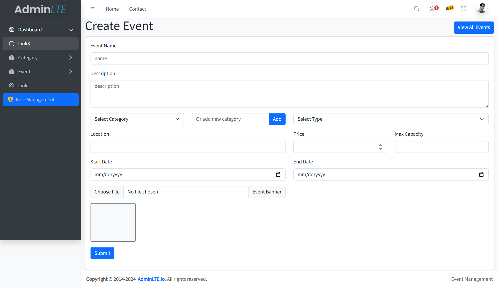

# Event Management System

<p align="center">
  <a href="https://laravel.com" target="_blank">
    
  </a>
</p>

## About

This is a **Event Management System** built with Laravel.  
It is designed to demonstrate my skills to recruiters and HR, showcasing my ability to work with modern PHP frameworks, authentication, role/permission management, and admin dashboards.

---

## Features

-   **Event CRUD**: Create, view, update, and delete events.
-   **Category Management**: Manage event categories.
-   **User Authentication**: Secure login, registration, and password reset.
-   **Role & Permission Management**: Assign roles and permissions to users.
-   **Admin Dashboard**: Responsive admin panel for managing the system.
-   **AJAX & jQuery**: For dynamic UI interactions (e.g., delete without page reload, image preview).
-   **Bootstrap 5 UI**: Modern, responsive design.

---

## Technologies Used

### Backend

-   **[Laravel 11](https://laravel.com/)**

    -   MVC architecture
    -   Eloquent ORM
    -   Routing, Controllers, Middleware
    -   Validation and Request classes

-   **[Laravel Breeze](https://laravel.com/docs/11.x/starter-kits#breeze-and-blade)**

    -   Simple authentication scaffolding (login, register, password reset)
    -   Blade templates

-   **[Spatie Laravel Permission](https://spatie.be/docs/laravel-permission/v6/introduction)**
    -   Role and permission management
    -   Middleware for route/controller protection
    -   Super admin bypass using `Gate::before`

### Frontend

-   **[AdminLTE Dashboard Template](https://adminlte.io/)** (Free version)

    -   Integrated as the admin panel UI
    -   Based on Bootstrap 5

-   **[Bootstrap 5](https://getbootstrap.com/)**

    -   Responsive grid and components

-   **[jQuery](https://jquery.com/)**
    -   Used for AJAX requests, DOM manipulation, and UI enhancements

---

## Key Implementations

-   **Authentication**:  
    Laravel Breeze provides secure authentication routes and views.

-   **Role & Permission**:

    -   Spatie package for assigning roles (e.g., admin, user, super admin)
    -   Permissions for CRUD operations on events, categories, etc.
    -   Super admin can access all features (using `Gate::before`).

-   **AdminLTE Integration**:

    -   Custom Blade layouts for admin dashboard
    -   Sidebar, navbar, and responsive widgets

-   **AJAX Features**:

    -   Delete actions without page reload
    -   Dynamic image preview before upload

-   **Form Validation**:
    -   Server-side validation with error feedback in forms

---

## Getting Started

1. **Clone the repository**

    ```bash
    git clone https://github.com/hasiboctane/project_2k25_two
    cd project_2k25_two
    ```

2. **Install dependencies**

    ```bash
    composer install
    npm install && npm run build
    ```

3. **Set up environment**

    - Copy `.env.example` to `.env` and configure your database and mail settings.

4. **Run migrations and seeders**

    ```bash
    php artisan migrate --seed
    ```

5. **Storage link**

    ```bash
    php artisan storage:link
    ```

6. **Start the server**
    ```bash
    php artisan serve
    ```

---

## Screenshots




---

## Why This Project?

This project is built as a **practice and showcase** for recruiters and HR to demonstrate:

-   My proficiency with Laravel and modern PHP
-   Experience with authentication and authorization
-   Ability to integrate and customize admin dashboards
-   Frontend and backend integration skills

---

## License

This project is open-sourced software licensed under the [MIT license](https://opensource.org/licenses/MIT).
